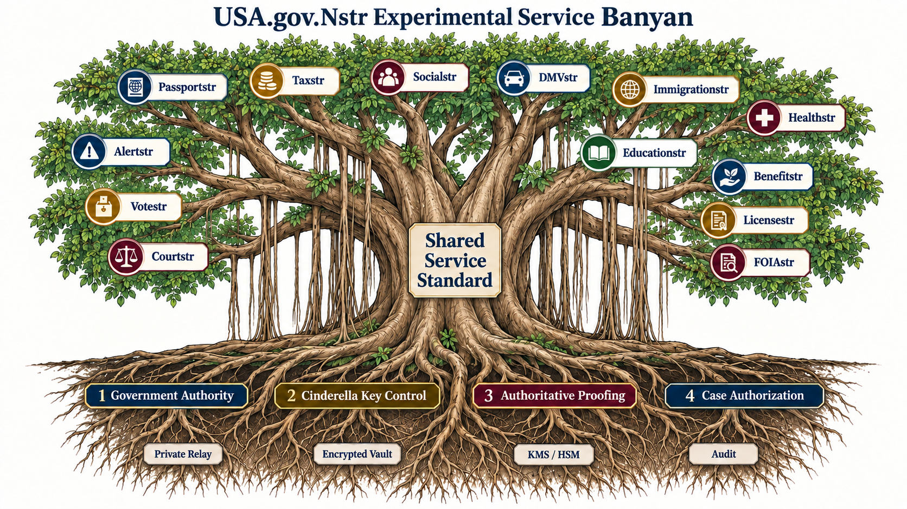

# USA.gov.Nstr Experimental Architecture

`usa.gov.Nstr` is an experimental architecture for signed, recoverable, and
privacy-separated public-service workflows built around Nostr protocols and
Cinderella threshold signing.

When nostr-station is running, the local architecture landing page is available
at `http://localhost:3000/usa-gov-nstr.html`.

It is a research and engineering proposal, not an official United States
government system. The documents use synthetic workflows and do not authorize
real passport, tax, identity, student-aid, immigration, health, voting, court,
benefit, licensing, emergency, or public-record actions.

## Banyan Model

- **Canopy and branches:** independently governed public-service workflows
- **Trunk:** the shared service standard and gateway architecture
- **Four primary roots:** government authority, Cinderella key control,
  authoritative proofing, and case authorization
- **Deep roots:** private relays, encrypted vaults, KMS/HSM protection, and
  auditable policy enforcement

The tree is intentionally broad: no person can implement the production system
alone. A real deployment would require funded collaboration among federal,
state, tribal, territorial, and local agencies, lawmakers, civil-rights and
privacy experts, security engineers, cryptographers, accessibility specialists,
service designers, operators, auditors, and the public.

## Start Here

1. [USA.gov.Nstr architecture](./USA-GOV-NSTR-ARCHITECTURE.md)
2. [Shared service standard](./USA-GOV-NSTR-SERVICE-STANDARD.md)
3. [Service catalog](./USA-GOV-NSTR-SERVICE-CATALOG.md)
4. [Cinderella government signing plan](./CINDERELLA-GOV-SIGNING-PLAN.md)

## Service Branches

- [Passportstr](./PASSPORTSTR-ARCHITECTURE.md)
- [Taxstr](./TAXSTR-ARCHITECTURE.md)
- [Socialstr](./SOCIALSTR-ARCHITECTURE.md)
- [Educationstr](./EDUCATIONSTR-ARCHITECTURE.md)
- [DMVstr](./DMVSTR-ARCHITECTURE.md)
- [Immigrationstr](./IMMIGRATIONSTR-ARCHITECTURE.md)
- [Healthstr](./HEALTHSTR-ARCHITECTURE.md)
- [Alertstr](./ALERTSTR-ARCHITECTURE.md)
- [Votestr](./VOTESTR-ARCHITECTURE.md)
- [Courtstr](./COURTSTR-ARCHITECTURE.md)
- [Benefitstr](./BENEFITSTR-ARCHITECTURE.md)
- [Licensestr](./LICENSESTR-ARCHITECTURE.md)
- [FOIAstr](./FOIASTR-ARCHITECTURE.md)

## Governing Principle

A valid Nostr signature proves control of signing authority. It does not by
itself prove identity, citizenship, eligibility, jurisdiction, factual
correctness, or legal authority. Every sensitive workflow therefore uses the
four-layer model and keeps protected records outside the relay.
